# Linux实用工具

> 持续更新

### 1. w

显示谁登录了系统并执行了哪些程序。
<pre>$ w</pre>

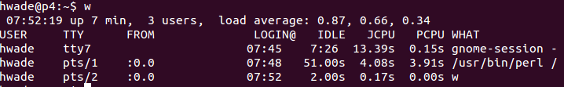
不显示头部信息
<pre>$ w -h</pre>
显示指定用户
<pre>$ w <username></pre>

### 2. nmon

Nmon(nigel's monitor的简写)是一个显示系统性能信息的工具。
<pre>$ nmon</pre>
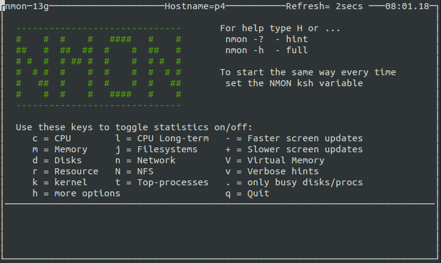
nmon可以显示磁盘、cpu、memory等信息
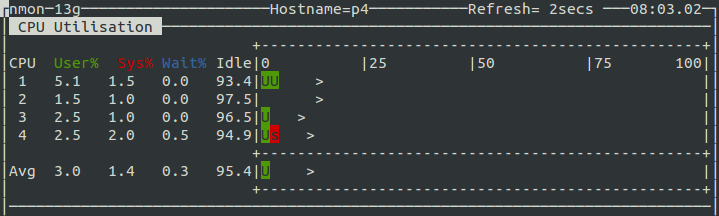
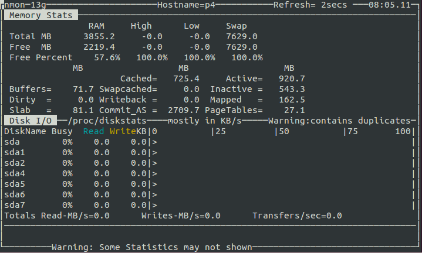

### 3. ncdu

是一个支持光标的du程序，这个命令是用来分析各种目录占用的磁盘空间。
<pre>$ ncdu</pre>
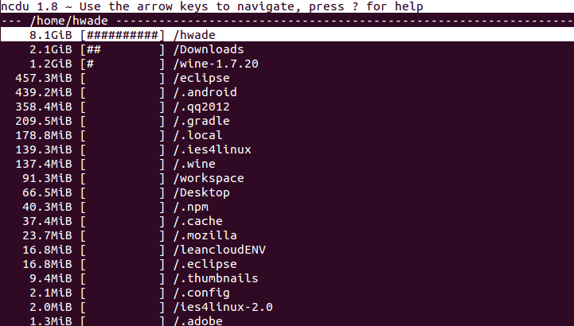
支持键盘上下方向键，回车进入相应的目录，按[n]则通过文件名排序，按[s]则通过文件大小排序（默认）

### 4. slurm

一个基于网络接口的带宽监控命令行程序，它会用字符来显示文本图形。
<pre>$ slurm -i <interface></pre>
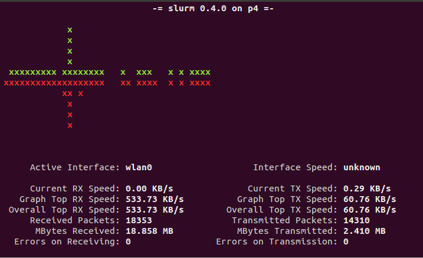

### 5. findmnt

Findmnt命令用于查找挂载的文件系统。它用来列出安装设备，当需要时也可以挂载或卸载设备，他是util-linux软件包一部分。
<pre>$ findmnt</pre>
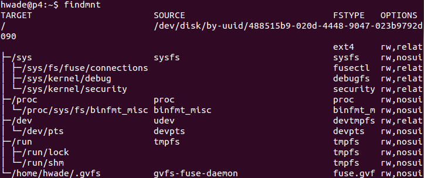
以列表格式输出
<pre>$ findmnt -l</pre>
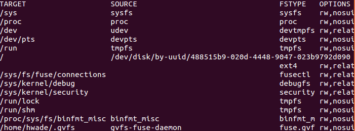
列出在fstab中挂载的文件系统。
<pre>$ findmnt -s</pre>
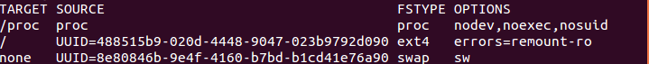
按文件类型列出已挂载的文件系统。
<pre>$ findmnt -t ext4</pre>
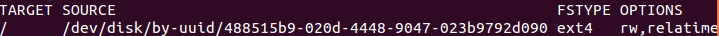

### 6. dstat

一种灵活的组合工具，它可用于监控内存，进程，网络和磁盘性能，它可以用来取代ifstat, iostat, dmstat等。查看有关cpu，硬盘和网络的详细信息。
<pre>$ dstat</pre>
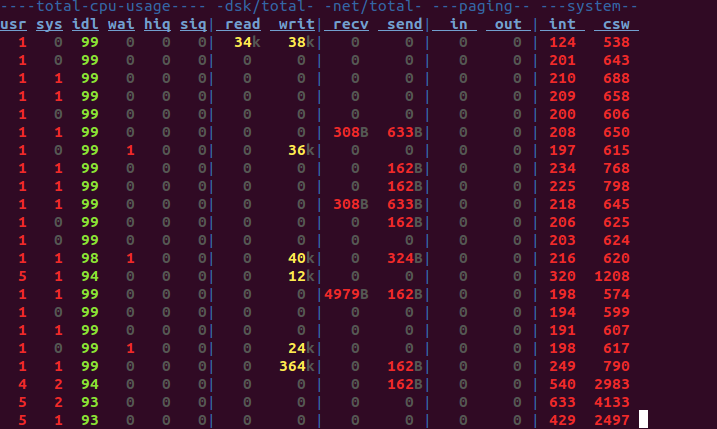
-c cpu
-d 磁盘
<pre>$ dstat -cdl -D sda1</pre>
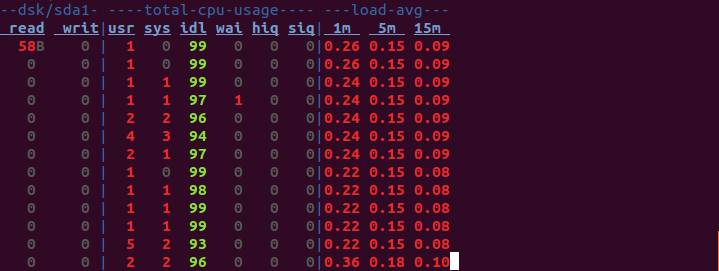

### 7. saidar

另一种基于命令行的系统统计数据监控工具，提供了有关磁盘使用，网络，内存，交换分区等信息。
<pre>$ saidar</pre>
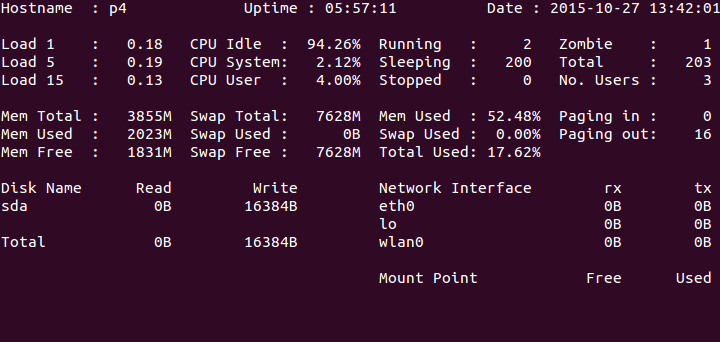
-c 启用颜色输出

### 8. ss

ss (socket statistics) 是一个很好的替代netstat的选择，它从内核空间收集信息，比netstat的性能更好。
<pre>$ ss</pre>

### 9. ccze

一个美化日志显示的工具。
<pre>$ tailf /var/log/syslog | ccze</pre>
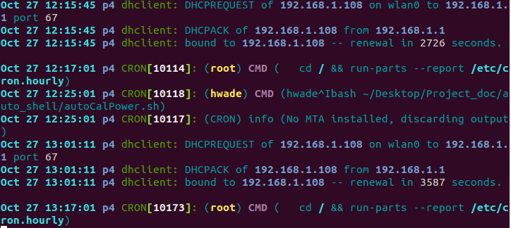
将日志保存为html文件。
<pre>$ tailf /var/log/syslog | ccze -h > /home/hwade/Desktop/cczelog.html</pre>
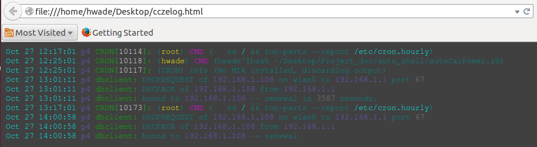
* ps: ccze命令运行完后不知为何好像不能自动关闭

### 10. ranwhen.py

一种基于Python的终端工具，它可以用来以图形方式显示系统活动状态。详细信息以一个丰富多彩的柱状图来展示。
首先要安装python3.2.
<pre>$ sudo apt-get install python3.2</pre>
* Download [ranwhen.py](https://github.com/p-e-w/ranwhen/archive/master.zip)

<pre>$ unzip ranwhen-master.zip && cd ranwhen-mast</pre>
<pre>$ python3.2 ranwhen.py</pre>
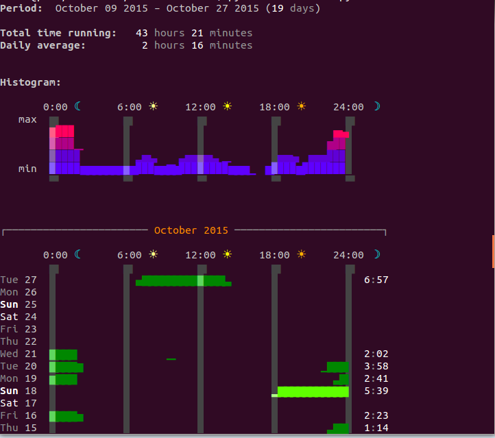
* ps:不知为何执行结果这么凌乱
